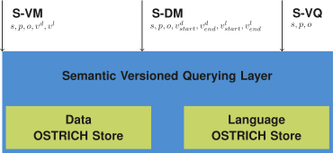

## Proof of Concept
{:#demo}

In order to provide a baseline of the proposed semantic versioned querying atoms,
we provide a prototypical implementation of a subset of the semantic versioned query atoms that were introduced in .
In this section, we describe this system, followed by an evaluation description, and a presentation of the results.

### System

Our prototype is implemented as an additional semantic layer on top of [OSTRICH](cite:cites ostrich),
which is a versioned RDF triple store that offers syntactical versioning.
As OSTRICH only supports VM, DM and VQ triple pattern queries at the time of writing,
we limit our implementation to the semantic extension of these atoms,
namely, S-VM, S-DM and S-VQ triple pattern queries.

As can be seen in , our semantic layer internally uses two OSTRICH stores,
one for the versioned dataset, and one for the versioned language.

As a backwards rule-based reasoner,
this semantic layer infers additional triples for each S-VM, S-DM or S-VQ query.
Rules can be provided in the [Notation 3 syntax](cite:cites n3) at query time.
It does this through the following steps:

1. Select applicable rules for the given triple pattern.
2. Query the dataset for the given triple pattern and version options.
4. Loop until set of inferred triples stops growing.
    1. Determine rules that can infer new triples
    2. Perform backwards reasoning with these rules by querying the dataset and language for the given triple pattern and version options.
    3. Add newly inferred triples to set of triples

<figure id="architecture">

<figcaption markdown="block">
Architecture overview of our semantic versioned querying layer on top of OSTRICH.
The required parameters for the three triple pattern-based queries are indicated,
with _vd_ indicating the version of the dataset,
and _vl_ indicating the version of the language.
</figcaption>
</figure>

The source code of this prototype can be found on [GitHub](https://github.com/rdfostrich/semantic-ostrich){:.mandatory}
and is available under the MIT license.

### Evaluation

In order to evaluate the performance of our semantic layer,
we executed several queries with inferencing of `rdfs:subClassOf` relationships
within the BEAR-B-daily dataset from the [BEAR benchmark](cite:cites bear).

To achieve this, we created a derived version of this BEAR-B-daily dataset
where we removed all `rdf:type` relationships from instances to classes that can be inferred
through `rdfs:subClassOf` relationships for each instance.
The (44) triples identifying the subclass relationships were stored in a single version inside the language store.
As the BEAR-B-daily dataset does not provide any versioning of the language,
our evaluation excludes versioning of the language.

As OSTRICH only supports VM, DM and VQ triple pattern queries,
we only evaluate their respective semantic extension,
always using the single language version.
For S-VM, we query the last version ,
for S-DM, we query between the first and last version,
and for S-VQ, we do an intermodal query using the single language version.

The source code of this evaluation can be found on [GitHub](https://github.com/rdfostrich/semantic-ostrich/blob/master/evaluate.js){:.mandatory}.

### Results

The original BEAR-B-daily dataset contains 48,914 unique triples in 88 dataset versions,
while the derived dataset contains 31,761 triples, which is a reduction of 35,07%.

,  and  respectively contain the evaluation results
for the S-VM, S-DM and S-VQ queries.
The table columns indicate the following:

* _Query_: The subject of the triple pattern that is queried.
* _Original_: Execution time of the query against the original BEAR-B-daily dataset.
* _Reduced_: Execution of the query against the derived BEAR-B-daily dataset, without inference from our semantic layer.
* _Inferred_: Execution of the query against the derived BEAR-B-daily dataset, with inference using our semantic layer.
* _Inference queries_: The number of queries against the OSTRICH store that were performed by the semantic layer.
* _Inferred normalized _: _Inferred_ execution time divided by the number of _inference queries_.

The results show that the backwards reasoner within our prototype
requires almost eight queries to the OSTRICH stores on average for this dataset.
The queries to the OSTRICH stores form the main bottleneck.

<figure id="results-s-vm" class="table" markdown="1">

| **Query** | **Original** | **Reduced** | **Inferred** | **Inference queries** | **Inferred normalized** |
| --------- | ------------ | ----------- | ------------ | --------------------- | ----------------------- |
| dbr:Palazzo_Parisio_(Valletta) | 0.56 | 0.25 | 2.51 | 10 | 0.25 |
| dbr:Singaporean_general_election,_2015 | 0.47 | 0.21 | 2.26 | 10 | 0.23 |
| dbr:What_Do_You_Mean? | 0.63 | 0.22 | 1.76 | 9 | 0.20 |
| dbr:Dancing_with_the_Stars_(U.S._season_21) | 0.58 | 0.23 | 1.55 | 6 | 0.26 |
| dbr:Doctor_Who_(series_9) | 0.33 | 0.15 | 0.97 | 6 | 0.16 |
| dbr:My_Little_Pony... | 0.15 | 0.09 | 0.94 | 7 | 0.13 |
| dbr:2015 | 0.26 | 0.12 | 0.89 | 6 | 0.15 |
| _Average_ | _0.42_ | _0.18_ | _1.55_ | _7.71_ | _0.20_ |

<figcaption markdown="block">
Execution times in milliseconds for S-VM queries against the last dataset version,
using the first language version for an 7 S?? triple patterns.
</figcaption>
</figure>

<figure id="results-s-dm" class="table" markdown="1">

| **Query** | **Original** | **Reduced** | **Inferred** | **Inference queries** | **Inferred normalized** |
| --------- | ------------ | ----------- | ------------ | --------------------- | ----------------------- |
| dbr:Palazzo_Parisio_(Valletta) | 0.45 | 0.21 | 3.32 | 10 | 0.33 |
| dbr:Singaporean_general_election,_2015 | 0.39 | 0.18 | 2.27 | 10 | 0.23 |
| dbr:What_Do_You_Mean? | 0.34 | 0.13 | 2.17 | 9 | 0.24 |
| dbr:Dancing_with_the_Stars_(U.S._season_21) | 0.40 | 0.20 | 1.06 | 6 | 0.18 |
| dbr:Doctor_Who_(series_9) | 0.18 | 0.12 | 1.14 | 6 | 0.19 |
| dbr:My_Little_Pony... | 0.12 | 0.11 | 2.47 | 7 | 0.35 |
| dbr:2015 | 0.36 | 0.18 | 1.84 | 6 | 0.31 |
| _Average_ | _0.32_ | _0.16_ | _2.04_ | _7.71_ | _0.26_ |

<figcaption markdown="block">
Execution times in milliseconds for S-DM queries between the first and last dataset versions,
both using the first language version for 7 S?? triple patterns.
</figcaption>
</figure>

<figure id="results-s-vq" class="table" markdown="1">

| **Query** | **Original** | **Reduced** | **Inferred** | **Inference queries** | **Inferred normalized** |
| --------- | ------------ | ----------- | ------------ | --------------------- | ----------------------- |
| dbr:Palazzo_Parisio_(Valletta) | 0.65 | 0.29 | 2.48 | 10 | 0.25 |
| dbr:Singaporean_general_election,_2015 | 0.83 | 0.28 | 2.16 | 10 | 0.22 |
| dbr:What_Do_You_Mean? | 0.58 | 0.17 | 1.24 | 9 | 0.14 |
| dbr:Dancing_with_the_Stars_(U.S._season_21) | 0.43 | 0.27 | 0.96 | 6 | 0.16 |
| dbr:Doctor_Who_(series_9) | 0.26 | 0.12 | 0.75 | 6 | 0.13 |
| dbr:My_Little_Pony... | 0.13 | 0.09 | 1.06 | 7 | 0.15 |
| dbr:2015 | 0.24 | 0.10 | 1.17 | 6 | 0.20 |
| _Average_ | _0.45_ | _0.19_ | _1.40_ | _7.71_ | _0.18_ |

<figcaption markdown="block">
Execution times in milliseconds for S-VQ queries for 7 S?? triple patterns.
</figcaption>
</figure>
